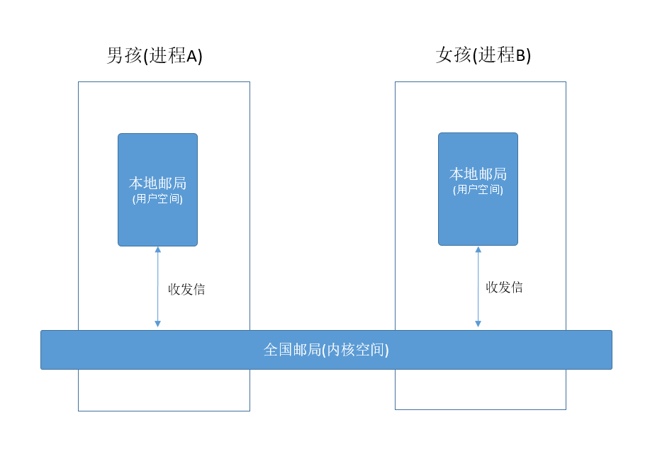
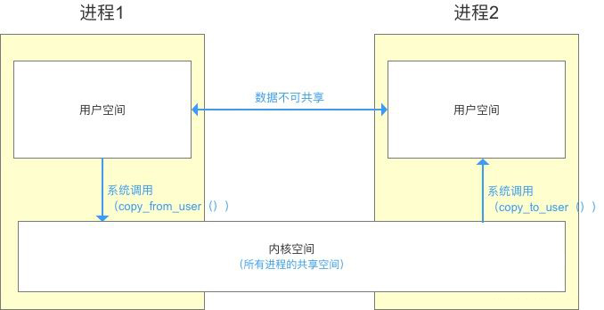
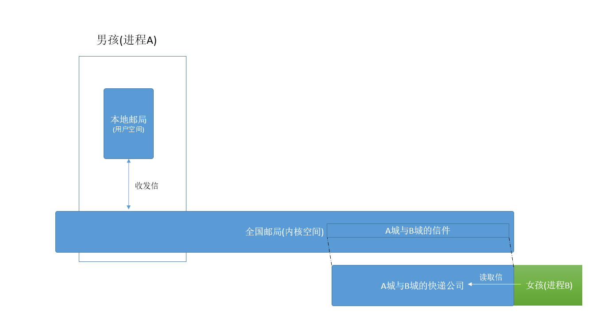
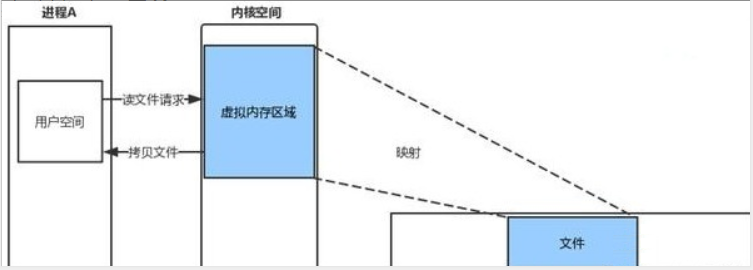
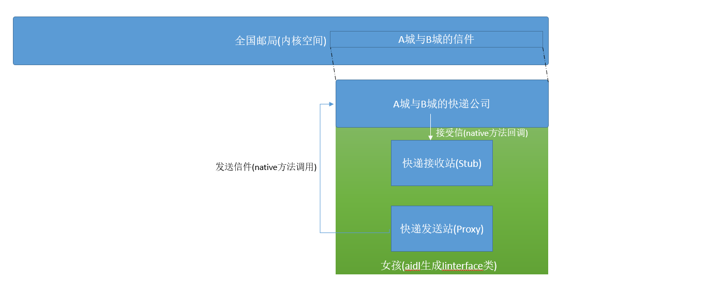

一次拷贝的原理

 

为什么会有Binder通信机制，为什么不能用linux中已有的进程框架呢？Google工程师究竟是如何考量的，

这一切需要从一场恋爱说起

了解binder之前我们看看原有Linux进程是如何通信的吧！ 为什么需要在内存中**拷贝两次**呢？

> 在了解Linux进程通信前我们先理解下 恋爱的故事吧！

故事:

男孩和女孩在某次旅游一见钟情，而旅行结束的他们不得不返回各自的工作城市，

> 那个时代还没有微信，由于相隔在不同的城市。相思念的他们只能通过**邮局**抒发彼此爱慕之情
>
> 如果男孩想要给女孩发送信封，需要向**本地邮局** 寄信。再有全国**邮局转发到** 女孩所在的本地邮局
>
> 最后由女孩所在的**本地邮局送到**女孩手中

在进程中的角色:

> **男孩** 称为进程A，工作城市A城，**女孩**称为进程B，工作城市B城
>
> **本地邮局**称为用户空间， **全国邮局**称为内核空间
>
> **本地邮局**是他们彼此 离的最近的地方。他们能够在本地邮局直接接受和发送信封 

##### **1.1 这是普通linux进程通信的方式**

> 转换专业术语的图

进程间，用户空间的数据不可共享，所以用户空间相当于私有空间

进程间，内核空间的数据可共享，所以内核空间 相当于公共空间

进程间如果需要做到通信，需要通过共享空间对数据转换。转换过程需要调用系统的api，这个过程称为**系统调用**

> 问题来了:

​		男孩写好信之后，发送信件给本地邮局 ，  相当于一次拷贝 我们把这个过程称为(**copy_from_user**)

女孩收到当地邮局通知，需要从本地邮局取信。相当于第二次拷贝，我们把这个过程称为(**copy_to_user**)

> 两次拷贝究竟性能怎么样，当然拷贝是非常耗性能的，而两次拷贝可以再优化优化。
>
> 那binder是怎么做到一次拷贝的呢

##### 1.2接着讲爱情的例子(Binder的实现机制)

**后来在疫情结束后，这个女孩去了全国邮局依赖的快递公司上班去了，所有的邮件需要用快递公司来处理，刚好这家快递公司处理的是他们两个城市的信件。**

> 这就给女孩创造了便利，不用去本地邮件取信件

> 但是男孩还是要发送信件。 binder拷贝也是发生在男孩这个地方copy_from_user，女孩由于在快递公司上班，可以随意浏览男孩的信件。不需要再取信件了。也就减少了从本地邮局取快递这次拷贝过程

**思考:**   大家还记不记的 接收端怎么写的，对!  接收端一定必须是服务Service，接收端不能是其他java对象。Service就是那个女孩。她必须在快递公司上班才能减少一次拷贝。所以这个Service，在通信前会注册在ServiceManager中。而男孩可以是任意对象，出现在任意地方

> Linux 已有的进程通信，发送端和接收端可以是任意对象。出现在任意类中。但是必须牺牲多拷贝一次
>
> Android的Binder通信，接受端不能是任意对象，只能是Service，这也节约了一次拷贝，牺牲了开发者的体验

##### 1.3 Binder少拷贝一次的原理:

​		全国邮局 相当于内核空间的内存，所有的应用都与内核空间的内存发生频繁的调用，在Binder中传递数据本质上是通过文件读取来实现的

> ​		大家记不记得Linux系统 是文件操作系统，都是基于文件展开的。进程通信中 File也能实现进程通信

​		Binder机制中 在内存与文件中设计了一层映射关系。**内核空间的内存是虚的的**。**文件IO是实的**。 映射指的是内存与文件的映射，映射是通过mmap函数，

​		而mmap函数 需要依赖一个文件，这个文件叫做“binder”。     对！ 他没有后缀名，他就是一个文件。但是人们习惯性的把它称为**binder驱动**。

**我们再来看看实际的是如何映射的**

> 1. 全国邮局中的A城与B城的信件，相当于内核空间内存一部分虚拟内存区域。
> 2. A城与B城的快递公司，相当于文件实体。实际上邮件是由快递公司转发。邮局与快递公司的合作关系，可以理解内存与文件形成了映射关系(mmap)

#####  1.4 服务端Service 也通过mmap函数监听文件的变化。

​		一旦有信件到达女孩的公司直接读取出来，而不用去本地邮件取信件。

> 女孩怎么在公司取出来呢？ 大家忘记了女孩在快递公司上班呢，快递公司会给员工分布工作内容
>
> 女孩的工作内容是**查看**快递接收站和快递发送站
>
> 这样你说能不能看到男朋友发过来的信件，还不用亲自跑到本地邮局，那不是爽歪歪

> 绿色部分 是女孩进程，绿色内有两个角色（女孩接触到的 接收站和收发站）

> 这一套机制的实现基于 aidl文件编译机制

​		在编译时生成了一个继承自Binder中的IInterface接口（女孩）。接口中有这样一个内部类叫**Stub**（女孩工作接触的接收站）和一个内部类叫**Proxy**（女孩工作接触的发送站）

> 男孩有邮件到了，女孩直接在 快递接收站查看男孩发过来的邮件(Stub中的 onTransact方法)
>
> 女孩思恋男孩，跟男孩发送邮件(Proxy中的transact方法)

**Stub与Proxy中所有的方法是native**直接调用过来的。参数是直接从内核空间传递过来的，不需要发生拷贝。

> 如果女孩需要给男孩发送消息，也不用跑到本地邮局，直接在 快递发送站，插入一个邮件就好了（调用Proxy的transct方法）

**减少一次拷贝发生在 服务端service。直接有nativie层 的Binder调起。不需要再次拷贝**

 大家看完了 是不是对整个Binder机制有深刻的认识呢

 从Binder的底层原理分析，让Android开发者真正了解到Binder的通信机制。从Linux进程通信技术认知到为什么Android会选择Binder作为通信方式，到Linux的进程原理，最后借鉴Binder中mmap函数打造优异的存储框架。

 
